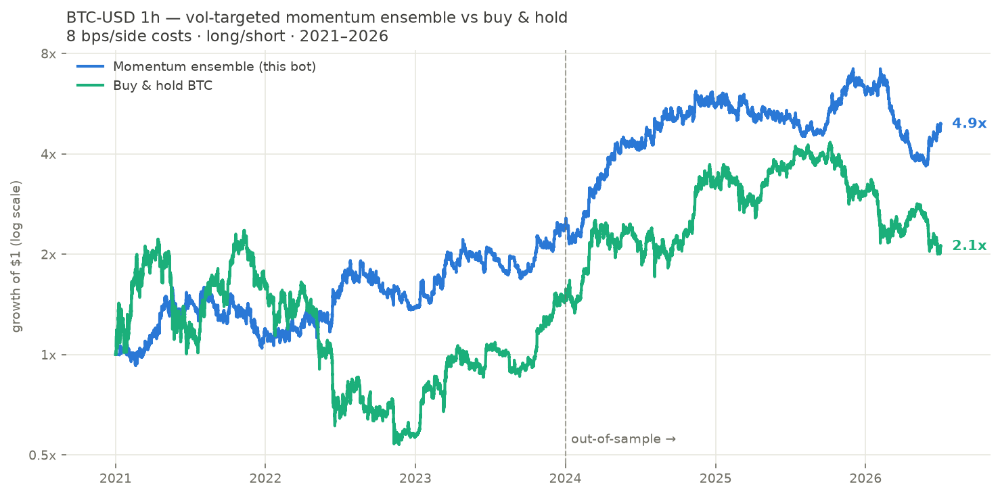

# BTC Short-Term Trading Bot

A long/short Bitcoin trading bot on 1-hour candles, built from a research
process that tested six strategy families across 5.5 years of data (2021–2026)
and kept the only one that survived out-of-sample and walk-forward validation:
a **volatility-targeted momentum ensemble**.



## Results (2021-01 → 2026-07, 8 bps/side costs)

|                | Strategy | Buy & hold |
|----------------|---------:|-----------:|
| Total return   | **+391%** | +111% |
| CAGR           | **+33.5%** | +14.6% |
| Sharpe (hourly, annualized) | **0.92** | 0.53 |
| Max drawdown   | **-49%** | -77% |

Yearly: 2021 **+18.6%** · 2022 (bear) **+16.8%** (B&H -64%) · 2023 **+73.6%** ·
2024 **+130%** · 2025 **+8.6%** (B&H -6%) · 2026 H1 **-18.3%** (B&H -30%).

**Walk-forward validation** (parameters re-chosen each year using only prior
data — zero hindsight): +214% total 2022–2026, CAGR 28.9%, Sharpe 0.84, vs
+32% buy & hold over the same period. It was profitable in the 2022 bear
(+17.5%) and the 2025 decline (+8.3%); in the 2026 downturn it lost less than
the market (-18.5% vs -29.9%).

## The strategy

Every hour, on the closed candle:

1. **Momentum signal ×3**: compute the 48h, 72h and 96h returns, and the
   z-score of each against its own trailing 168h distribution. A z-score
   above +1.5 votes long, below -1.5 votes short; otherwise the vote holds
   its previous direction (momentum persists — exiting to flat tested well
   in-sample but failed out-of-sample).
2. **Ensemble**: average the three votes → position direction in
   {-1, -⅔, -⅓, 0, +⅓, +⅔, +1}.
3. **Volatility targeting**: scale the position by `min(1, 50% / realized
   annualized vol)` (72h window, quantized in 0.25 steps to avoid fee churn).
   This is what cut the max drawdown from -80% to about -49% while keeping
   the returns — the direction signal is untouched.

Why it works in both bull and bear markets: it is symmetric (shorts the
downtrends it detects, which is where 2022's +17% came from), and vol
targeting automatically de-risks in panics, when crypto volatility explodes.

## What was tested and rejected

Six families, parameter-swept on 2021–2023 and validated on 2024–2026
(`research/run_backtests.py`):

| Family | Verdict |
|---|---|
| EMA cross (trend) | Chop losses eat the trend gains; OOS ≈ 0 |
| Donchian breakout | Negative after costs in both periods |
| Donchian + ATR trailing stop | Positive in-sample, fell apart OOS |
| RSI dip mean-reversion (trend-filtered) | Classic overfit: Sharpe 0.76 train, -0.91 test |
| Regime-switched hybrid (trend↔mean-rev) | Worst of the sweep; regime detection lagged |
| **Vol-gated z-score momentum** | **Only family positive in train AND test; whole top-8 of round 3 profitable OOS** |

Fee stress test: profitable up to 16 bps/side (Sharpe 0.66); dead at 25 bps.
Trade on a venue with taker fees ≤ 10 bps or use limit orders.

## Repo layout

```
bot/
  indicators.py    # causal TA indicators (EMA, RSI, ATR, ADX, Donchian, z-score)
  strategies.py    # all strategy families incl. the winner (vol_momentum_ens_sized)
  backtest.py      # vectorized backtester: 1-bar execution delay, turnover costs
  live.py          # the bot: paper trading + live-execution stub
research/
  run_backtests.py # round 1: 6-family parameter sweep, train/test split
  round2.py        # round 2: hysteresis exits (rejected — failed OOS)
  round3.py        # round 3: vol-targeted sizing + ensemble (winner)
  walkforward.py   # yearly walk-forward validation + fee stress test
  make_chart.py    # equity-curve chart
data/
  fetch_data.py    # Coinbase public API downloader (no key needed)
  btc_1h.csv       # 48k hourly BTC-USD candles, 2021-01 → 2026-07
tests/test_bot.py  # no-lookahead, cost-accounting, output-validity tests
```

## Usage

```bash
pip install -r requirements.txt

# refresh data and reproduce the research
python data/fetch_data.py
python -m research.run_backtests
python -m research.walkforward

# run the bot (paper trading — no keys, no risk)
python -m bot.live            # one evaluation, cron-friendly
python -m bot.live --loop     # evaluate every hour

# tests
python -m pytest tests/
```

Paper state (position, simulated equity, trade log) persists in
`bot_state.json`. To trade real money, implement
`ExchangeExecutor.execute()` in `bot/live.py` against your venue (ccxt
makes this ~20 lines for a perp) — and start with a size you can afford
to lose entirely.

## Honest limitations

- **Backtest ≠ future.** The edge is a slow-moving hourly momentum effect
  that has persisted 5+ years in BTC, but it degrades in strong chop
  (2026 H1 was net negative) and could decay entirely.
- -49% max drawdown happened in-sample *and* would have happened live in
  2026. Size accordingly; halving the vol target roughly halves both
  drawdown and CAGR.
- Costs model taker fees + slippage as a constant 8 bps/side; thin books,
  funding rates on perps, and exchange outages are not modeled.
- Shorting requires a perpetual/margin venue. Spot-only accounts can run
  the long side only (expect roughly half the edge).
- This is research code, not financial advice.
